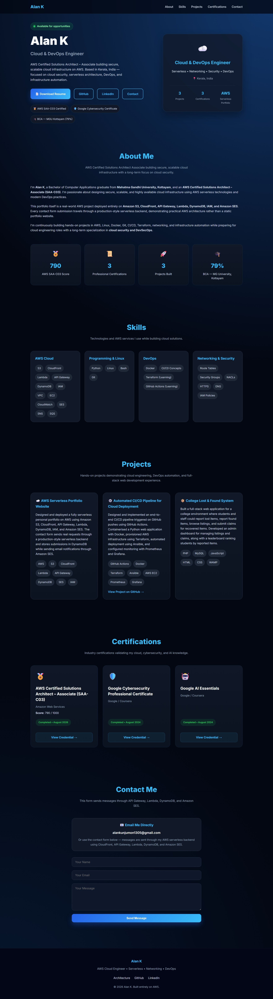
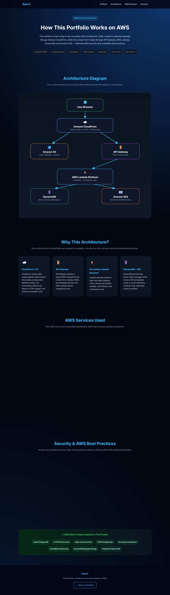

# ☁️ AWS Serverless Portfolio Website

> A production-style serverless portfolio website built entirely on **Amazon Web Services (AWS)** using a modern cloud-native architecture.


---

## 🌐 Live Portfolio

**Portfolio Website:** *Paste your CloudFront URL here.*

**GitHub Repository:** `https://github.com/alankunjumon/aws-portfolio`

---

## 📖 Project Overview

This project demonstrates the design and deployment of a **fully serverless personal portfolio website** using AWS managed services.

The frontend is hosted in **Amazon S3** and delivered globally through **Amazon CloudFront** over HTTPS. A contact form communicates with a serverless backend powered by **Amazon API Gateway** and **AWS Lambda**, where submissions are stored in **Amazon DynamoDB** and email notifications are sent through **Amazon SES**.

The project follows AWS best practices for serverless architecture, IAM security, HTTPS delivery, and cloud-native deployment without managing any EC2 instances.

---

## 🏗️ AWS Architecture

The application follows the request flow below.

```text
Visitor Browser
        │
        ▼
Amazon CloudFront (HTTPS + CDN)
        │
        ├────────► Amazon S3
        │          Static Website Assets
        │
        └────────► API Gateway
                   POST /api/contact
                          │
                          ▼
                   AWS Lambda (Python)
                     │            │
                     ▼            ▼
             Amazon DynamoDB   Amazon SES
              Store Messages  Email Notification
```


## ☁️ AWS Services Used

| AWS Service            | Purpose                                                                        |
| ---------------------- | ------------------------------------------------------------------------------ |
| **Amazon S3**          | Hosts the static portfolio website and downloadable resume.                    |
| **Amazon CloudFront**  | Delivers the website globally over HTTPS with CDN caching and request routing. |
| **Amazon API Gateway** | Provides the REST API endpoint for the contact form.                           |
| **AWS Lambda**         | Serverless Python backend that processes contact form submissions.             |
| **Amazon DynamoDB**    | Stores visitor contact messages in a NoSQL database.                           |
| **Amazon SES**         | Sends real-time email notifications after successful submissions.              |
| **AWS IAM**            | Implements least-privilege permissions between AWS services.                   |
| **Amazon CloudWatch**  | Logs and monitors Lambda execution for debugging and monitoring.               |

---

## ✨ Features

### Frontend

* Responsive portfolio website built with HTML, CSS, and JavaScript.
* Modern dark-themed UI.
* Projects and certifications section.
* Resume download hosted on Amazon S3.
* Dedicated AWS Architecture page.
* Smooth scrolling navigation.
* Mobile-friendly design.

### Backend

* Serverless contact form using API Gateway and Lambda.
* Input validation before processing requests.
* Contact messages stored in DynamoDB.
* Email notifications sent using Amazon SES.
* CloudWatch monitoring and logging.

---

## 📸 Application Preview

### Homepage



### AWS Architecture Page



---

## 📂 Project Structure

```text
aws-portfolio/
├── index.html
├── architecture.html
├── css/
│   ├── style.css
│   └── architecture.css
├── js/
│   ├── app.js
│   └── architecture.js
├── backend/
│   └── contact_handler.py
├── docs/
│   ├── aws-resources.md
│   └── deployment-guide.md
├── assets/
│   ├── Alan_K_Resume.pdf
│   └── screenshots/
│       ├── homepage.jpeg
│       └── architecture.jpeg
├── README.md
├── LICENSE
└── .gitignore
```

---

## 🚀 Contact API

### Endpoint

```http
POST /api/contact
```

### Request Body

```json
{
  "name": "John Doe",
  "email": "john@example.com",
  "message": "Hello Alan! I'd like to connect."
}
```

### Backend Workflow

1. User submits the contact form.
2. API Gateway receives the POST request.
3. AWS Lambda validates the request payload.
4. DynamoDB stores the contact message.
5. Amazon SES sends an email notification.
6. Lambda returns a JSON success response.
7. The frontend displays a confirmation message.

---

## 🔒 Security Best Practices Implemented

* HTTPS enforced through Amazon CloudFront.
* Amazon S3 protected using Origin Access Control (OAC).
* IAM Least-Privilege permissions for Lambda execution.
* Backend validation before database writes.
* CloudWatch logging for monitoring and debugging.
* Fully serverless architecture with no EC2 servers to manage.

---

## 📦 Deployment Summary

The application is deployed entirely using AWS managed services.

### Deployment Steps

1. Upload frontend files to Amazon S3.
2. Configure CloudFront with S3 and API Gateway origins.
3. Deploy the Lambda backend.
4. Connect API Gateway with Lambda.
5. Configure the DynamoDB table.
6. Verify Amazon SES email identities.
7. Invalidate CloudFront cache after frontend updates.

Detailed deployment documentation is available in:

* `docs/deployment-guide.md`
* `docs/aws-resources.md`

---

## 🧠 Skills Demonstrated

### AWS Cloud

* Amazon S3
* Amazon CloudFront
* Amazon API Gateway
* AWS Lambda
* Amazon DynamoDB
* Amazon SES
* AWS IAM
* Amazon CloudWatch

### Backend & Frontend

* Python
* HTML5
* CSS3
* JavaScript
* REST API Development
* Serverless Architecture

---

## 📈 Project Highlights

* Designed and deployed a production-style serverless portfolio website using AWS.
* Configured CloudFront with multiple origins for frontend and backend routing.
* Built a serverless backend using AWS Lambda and API Gateway.
* Stored visitor messages in DynamoDB.
* Integrated Amazon SES for real-time email notifications.
* Implemented IAM least-privilege permissions and CloudWatch logging.
* Deployed and maintained the application without managing any servers.

---

## 👨‍💻 Author

# Alan K

**AWS Certified Solutions Architect – Associate (SAA-C03)**

Cloud Engineer • DevOps Enthusiast • Serverless Architecture

**LinkedIn:** https://www.linkedin.com/in/alan-kunjumon

**Portfolio:** https://d343tuwzqee0su.cloudfront.net

---

## ⭐ About This Repository

This repository contains the complete source code, documentation, and deployment guide for my AWS Serverless Portfolio Website project. It was built as a hands-on cloud engineering project to demonstrate practical experience with AWS serverless services and modern cloud architecture.
